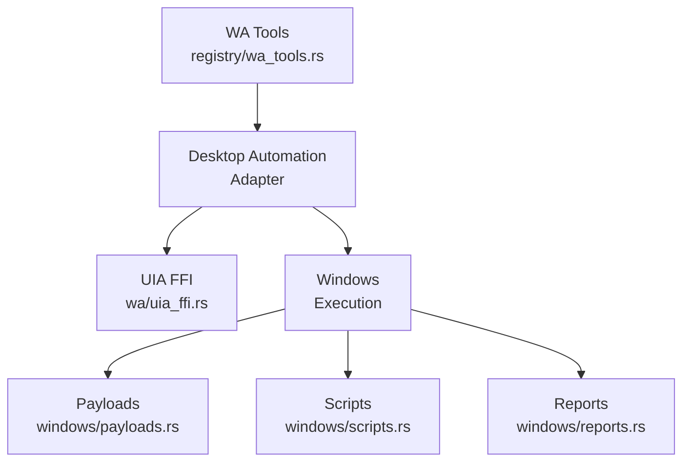

# Tool Registry and Windows Automation

<cite>
**Referenced Files in This Document**
- [velocity-mcp/src/registry/mod.rs](file://velocity-mcp/src/registry/mod.rs)
- [velocity-mcp/src/registry/dispatch.rs](file://velocity-mcp/src/registry/dispatch.rs)
- [velocity-mcp/src/registry/system_tools.rs](file://velocity-mcp/src/registry/system_tools.rs)
- [velocity-mcp/src/registry/team_tools.rs](file://velocity-mcp/src/registry/team_tools.rs)
- [velocity-mcp/src/registry/wa_tools.rs](file://velocity-mcp/src/registry/wa_tools.rs)
- [velocity-mcp/src/registry/browser_tools/mod.rs](file://velocity-mcp/src/registry/browser_tools/mod.rs)
- [velocity-mcp/src/wa/mod.rs](file://velocity-mcp/src/wa/mod.rs)
- [velocity-mcp/src/wa/uia_ffi.rs](file://velocity-mcp/src/wa/uia_ffi.rs)
</cite>

## Tool Registry

The MCP tool registry (`velocity-mcp/src/registry/`) defines and dispatches all tools available to the agent loop.

### Tool Categories

| Category | Files | Tools |
|----------|-------|-------|
| System | `system_tools.rs`, `tool_definitions/system.rs` | File read/write, shell commands, search, git |
| Browser | `browser_tools/` (7 files) | Navigation, inspection, rendering, workflows, sessions |
| Team | `team_tools.rs`, `tool_definitions/team.rs` | Multi-agent coordination, worktree management |
| WA | `wa_tools.rs`, `tool_definitions/wa.rs` | Desktop automation, UI interaction, screenshots |

### Dispatch Flow

1. Agent emits tool call in response
2. `dispatch.rs` routes to the correct category
3. Category handler validates parameters
4. Tool executes and returns result
5. Result streamed back to agent loop

### Browser Tools (`registry/browser_tools/`)

| Submodule | Purpose |
|-----------|---------|
| `native/` (7 files) | Native browser actions, assertions, inspection, rendering, waits |
| `navigation.rs` | URL navigation, history, tabs |
| `session.rs` | Session lifecycle management |
| `workflow.rs` | Multi-step browser workflows |

## Windows Automation (`src/wa/` — 29 files)

The WA module provides cross-platform desktop automation, with primary support for Windows via UIA FFI.

### Architecture

### Key Modules

| Module | Purpose |
|--------|---------|
| `uia_ffi.rs` | Windows UI Automation COM FFI bindings |
| `platform.rs` | Platform detection and abstraction |
| `selector.rs` | UI element selection and targeting |
| `advanced_input.rs` | Keyboard/mouse input simulation |
| `screenshot.rs` | Screen capture |
| `ocr.rs` | On-screen text recognition |
| `clipboard.rs` | Clipboard read/write |
| `window_mgmt.rs` | Window manipulation |
| `multi_monitor.rs` | Multi-display support |
| `virtual_desktop.rs` | Virtual desktop switching |
| `process_mgmt.rs` | Process lifecycle |
| `file_dialog.rs` | Native file dialogs |
| `notifications.rs` | System notification handling |
| `recording.rs` | User action recording |
| `recovery.rs` | Error recovery and retry |
| `storage.rs` | Persistent WA state |
| `triggers.rs` | Event-driven automation triggers |
| `events.rs` | UI event handling |
| `model.rs` | WA data models |
| `runtime.rs` | WA runtime lifecycle |
| `registry.rs` | WA element registry |
| `browser_bridge.rs` | Bridge between WA and browser engine |
| `nda.rs` | WA state persistence in NDA format |

### Windows Execution (`wa/windows/`)

- **Execution** (`execution.rs`): Synthesize and execute UI actions
- **Payloads** (`payloads.rs`): Action payload construction
- **Scripts** (`scripts.rs`): Automation script definitions
- **Reports** (`reports.rs`): Execution result reporting

**Section sources**
- [velocity-mcp/src/registry/mod.rs](file://velocity-mcp/src/registry/mod.rs)
- [velocity-mcp/src/wa/mod.rs](file://velocity-mcp/src/wa/mod.rs)
