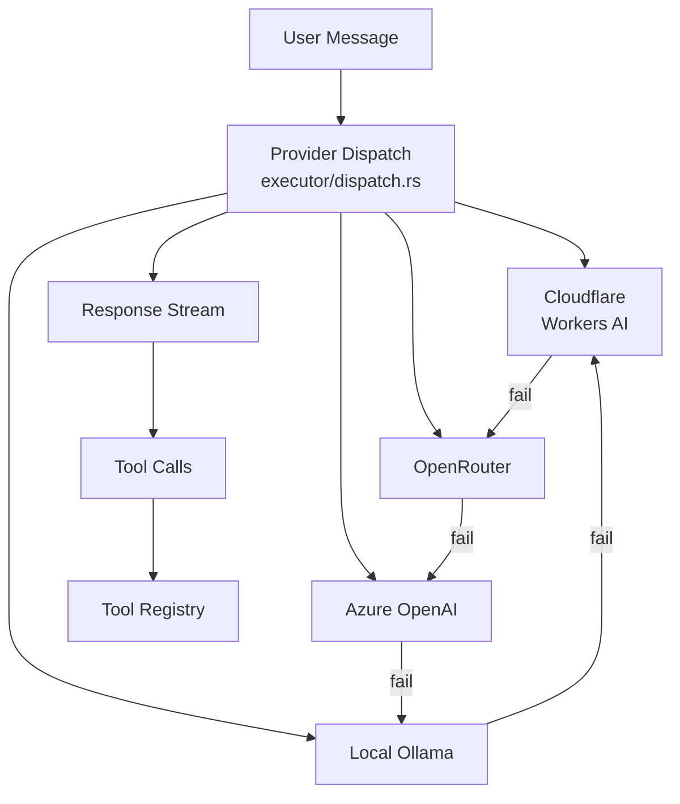

# 4-Provider Agent Reasoning Loop

<cite>
**Referenced Files in This Document**
- [velocity-mcp/src/agent/mod.rs](file://velocity-mcp/src/agent/mod.rs)
- [velocity-mcp/src/agent/provider.rs](file://velocity-mcp/src/agent/provider.rs)
- [velocity-mcp/src/agent/reasoning.rs](file://velocity-mcp/src/agent/reasoning.rs)
- [velocity-mcp/src/agent/executor/dispatch.rs](file://velocity-mcp/src/agent/executor/dispatch.rs)
- [velocity-mcp/src/agent/executor/loop_runner.rs](file://velocity-mcp/src/agent/executor/loop_runner.rs)
- [velocity-mcp/src/agent/executor/team_routing.rs](file://velocity-mcp/src/agent/executor/team_routing.rs)
- [velocity-mcp/src/agent/models.rs](file://velocity-mcp/src/agent/models.rs)
- [velocity-mcp/src/agent/memory_store.rs](file://velocity-mcp/src/agent/memory_store.rs)
</cite>

## Overview

The agent reasoning engine provides a 4-provider automatic failover chain for AI inference. It manages provider selection, request routing, compressed history, reasoning effort routing, and multi-agent coordination.

## Provider Chain

| Priority | Provider | Model | Auth |
|----------|----------|-------|------|
| 1 | Cloudflare Workers AI | `@cf/moonshotai/kimi-k2.7-code` | API key |
| 2 | OpenRouter | `tencent/hy3:free` or custom | API key |
| 3 | Azure OpenAI | `gpt-4o` | Deployment + API key |
| 4 | Local Ollama | `llama3.2` / `qwen2.5-coder` / `deepseek-r1` | None (localhost) |

Failover is circular: if Ollama fails, it wraps back to Cloudflare.

## Architecture



## Key Components

| Component | File | Role |
|-----------|------|------|
| Provider trait | `agent/provider.rs` | Common interface for all backends |
| Dispatch | `agent/executor/dispatch.rs` | Select and failover between providers |
| Loop Runner | `agent/executor/loop_runner.rs` | Execute reasoning loop with tool calls |
| Team Routing | `agent/executor/team_routing.rs` | Route tasks to specialized agents |
| Models | `agent/models.rs` | Provider model definitions |
| Memory Store | `agent/memory_store.rs` | Compressed history and context |
| Reasoning | `agent/reasoning.rs` | Reasoning effort level routing |
| Thread Entry | `agent/executor/thread.rs` | Agent thread spawn, API key resolution, FetchPanelData delegation to shared `system_tools::fetch_panel_data_value()` (879 LOC) |

## Multi-Agent Features

- **Background Agents** (`agent/background_agents.rs`): Long-running agents operating independently
- **Collaboration** (`agent/collaboration.rs`): Multi-agent coordination protocols
- **Conflict Resolution** (`agent/conflict_resolution.rs`): Handle conflicting agent actions
- **Peer Bridge** (`agent/peer_bridge.rs`, `peer_link.rs`, `peer_server.rs`): P2P agent communication
- **Planning** (`agent/planning.rs`): Multi-step task planning
- **Self-Improvement** (`agent/self_improve.rs`): Agent learning from outcomes

## Configuration

Providers are configured via `.env`:

```env
LLM_PROVIDER=cloudflare
OPENROUTER_API_KEY=your-key
AZURE_OPENAI_API_KEY=your-key
AZURE_OPENAI_ENDPOINT=https://your-resource.openai.azure.com/
OLLAMA_HOST=http://localhost:11434
```

## History and Token Management

- Compressed history via `memory_store.rs`
- Ring-buffer activity logs
- Reasoning effort payload routing (low/medium/high)
- Token counting and context window management

**Section sources**
- [velocity-mcp/src/agent/mod.rs](file://velocity-mcp/src/agent/mod.rs)
- [velocity-mcp/src/agent/executor/dispatch.rs](file://velocity-mcp/src/agent/executor/dispatch.rs)
