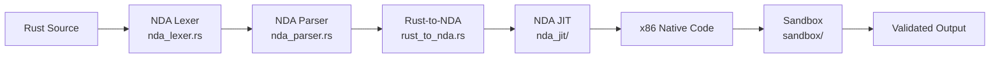

# NDA Compiler and JIT Pipeline

<cite>
**Referenced Files in This Document**
- [velocity-ide/src/compiler/mod.rs](file://velocity-ide/src/compiler/mod.rs)
- [velocity-ide/src/compiler/nda_lexer.rs](file://velocity-ide/src/compiler/nda_lexer.rs)
- [velocity-ide/src/compiler/nda_parser.rs](file://velocity-ide/src/compiler/nda_parser.rs)
- [velocity-ide/src/compiler/rust_to_nda.rs](file://velocity-ide/src/compiler/rust_to_nda.rs)
- [velocity-ide/src/compiler/wasm_runner.rs](file://velocity-ide/src/compiler/wasm_runner.rs)
- [velocity-ide/src/compiler/fuzzer.rs](file://velocity-ide/src/compiler/fuzzer.rs)
- [velocity-ide/src/compiler/nda_jit/mod.rs](file://velocity-ide/src/compiler/nda_jit/mod.rs)
- [velocity-ide/src/compiler/nda_jit/compiler.rs](file://velocity-ide/src/compiler/nda_jit/compiler.rs)
- [velocity-ide/src/compiler/nda_jit/x86_emitter.rs](file://velocity-ide/src/compiler/nda_jit/x86_emitter.rs)
- [velocity-ide/src/compiler/shaders/mod.rs](file://velocity-ide/src/compiler/shaders/mod.rs)
- [velocity-ide/src/compiler/driver/mod.rs](file://velocity-ide/src/compiler/driver/mod.rs)
</cite>

## Overview

The `velocity-ide` compiler pipeline transforms Rust source code into NDA bytecode, JIT-compiles to native x86, and validates in a sandboxed environment. It also includes GPU shader compilation for model inference acceleration.

## Pipeline Stages

### Stage 1: Lexing (`nda_lexer.rs`)
Tokenizes Rust source into NDA-compatible token stream. Handles Rust syntax including macros, lifetimes, and trait bounds.

### Stage 2: Parsing (`nda_parser.rs`)
Builds an AST from the token stream. Validates structural correctness and produces NDA intermediate representation.

### Stage 3: Lowering (`rust_to_nda.rs`)
Converts the Rust AST into NDA bytecode. Maps Rust constructs to NDA operations.

### Stage 4: JIT Compilation (`nda_jit/`)
- **Compiler** (`compiler.rs`): NDA bytecode → native code
- **x86 Emitter** (`x86_emitter.rs`): Machine code generation
- **Optimizer** (`optimizer.rs`): Peephole and constant folding
- **Symbolic Loop** (`symbolic_loop.rs`): Loop analysis and unrolling
- **Exec Page** (`exec_page.rs`): Executable memory page management
- **VM Helpers** (`vm_helpers.rs`): Runtime support functions

### Stage 5: Sandbox Execution (`sandbox/`)
- **JIT Sandbox** (`jit_sandbox.rs`): Isolated execution environment
- **Scope Validator** (`scope_validator.rs`): Validates memory access boundaries

## GPU Shader Pipeline (`compiler/shaders/` — 16 files)

Shader modules for GPU-accelerated model inference:

| Shader | Purpose |
|--------|---------|
| `act_bitnet.rs` | BitNet activation |
| `act_nda.rs` | NDA activation |
| `act_qwen.rs` | Qwen activation |
| `attn_contig.rs` | Contiguous attention |
| `attn_ndakv.rs` | NDA key-value attention |
| `attn_softmax.rs` | Softmax attention |
| `bias_add.rs` | Bias addition |
| `fp2.rs` / `fp4.rs` | Low-precision formats |
| `int4.rs` | 4-bit integer ops |
| `kv_write.rs` | KV cache write |
| `nda.rs` | Core NDA shader |
| `residual_add.rs` | Residual connection |
| `rms_norm.rs` | RMS normalization |
| `rope.rs` | Rotary position embedding |
| `swiglu.rs` | SwiGLU activation |
| `ternary.rs` | Ternary operations |

## Model Driver (`compiler/driver/` — 12 files)

Orchestrates GPU execution for transformer model inference:

- **Pipeline Execution** (`pipeline_execution.rs`): End-to-end inference pipeline
- **Model Pipeline** (`model_pipeline.rs`): Model-specific configuration
- **BitNet Layer** (`bitnet_layer.rs`, `nda_bitnet_layer.rs`): 1-bit inference layers
- **Qwen Layer** (`qwen_layer.rs`): Qwen model layers
- **GEMV** (`gemv.rs`, `nda_gemv.rs`): General matrix-vector multiplication with `scales: [f32; 3]` infrastructure
- **Layer GPU GEMVs** (`layer_gpu_gemvs.rs`): GPU-dispatched GEMV operations, fused QKV and gate-up projections
- **Packing** (`packing.rs`): Weight packing for GPU
- **Vulkan Init** (`vulkan_init.rs`): Vulkan device initialization
- **Vulkan Benchmark** (`vulkan_benchmark.rs`): GPU performance measurement

## Model Inference (`model/` — 5 files)

The transformer model stack for built-in LLM inference:

- **Config** (`config.rs`): `ModelConfig::qwen_coder_05b()` — 24 layers, hidden=896, GQA 14/2, ALiBi positional encoding
- **Weights** (`weights.rs`): NDA-4bit (FP4) weight loading from `.nda` files, `concat_gpu_gemv()` for fused Q‖K‖V and gate‖up projections
- **Transformer** (`transformer.rs`): Zero-alloc `forward_one()` returning `&[f32]`, in-place `lm_head()` writing to `&mut [f32]`, autoregressive generation with temperature/top-p sampling

## Dual-Path Engine (top-level)

- **Pipeline Bridge** (`pipeline_bridge.rs`): `DualPathEngine` routes between Path 1 (text) and Path 2 (NDA)
- **NDA Pipeline** (`pipeline_nda.rs`): NDA-native pipeline with Merkle-verified output
- **Tokenizer** (`tokenizer.rs`): BPE tokenizer for Qwen's 151,936-token vocabulary

**Section sources**
- [velocity-ide/src/compiler/mod.rs](file://velocity-ide/src/compiler/mod.rs)
- [velocity-ide/Cargo.toml](file://velocity-ide/Cargo.toml)
