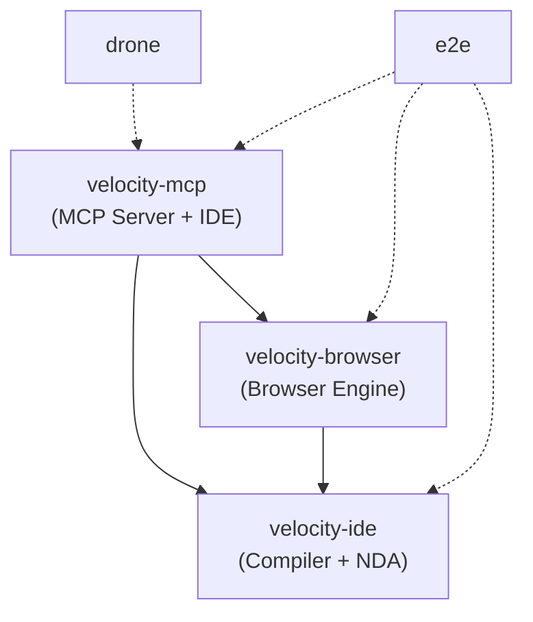
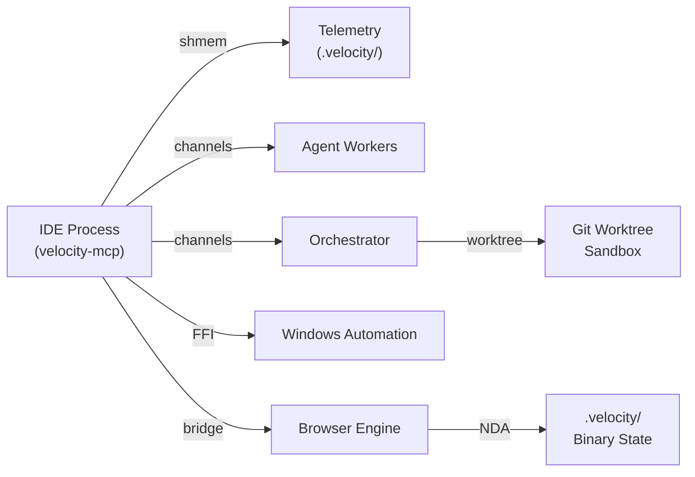

# Workspace Architecture Overview

<cite>
**Referenced Files in This Document**
- [Cargo.toml](file://Cargo.toml)
- [AGENTS.md](file://AGENTS.md)
- [velocity-mcp/src/lib.rs](file://velocity-mcp/src/lib.rs)
- [velocity-browser/src/lib.rs](file://velocity-browser/src/lib.rs)
- [velocity-ide/src/lib.rs](file://velocity-ide/src/lib.rs)
- [velocity-mcp/src/main.rs](file://velocity-mcp/src/main.rs)
</cite>

## Table of Contents
1. [Three-Crate Workspace](#three-crate-workspace)
2. [Dependency Graph](#dependency-graph)
3. [Thread Model](#thread-model)
4. [IPC Topology](#ipc-topology)
5. [Data Flow](#data-flow)
6. [Key Design Decisions](#key-design-decisions)

## Three-Crate Workspace

Velocity is organized as a Cargo workspace with three primary crates, each owning a distinct domain:

### velocity-mcp (257 files)
The primary crate and user-facing surface. Contains:
- **Agent loop** (`src/agent/`): 4-provider AI reasoning with failover
- **Editor** (`src/editor/`): egui-based IDE with 30+ feature modules
- **Tool registry** (`src/registry/`): MCP tool dispatch (system, browser, team, WA)
- **Automation** (`src/automation/`): Task routing, build runner, watchers
- **Orchestrator** (`src/orchestrator/`): DAG scheduler, worktree isolation
- **Windows Automation** (`src/wa/`): UIA FFI, desktop control (29 files)
- **Protocol** (`src/protocol/`): JSON-RPC and NMCP binary

### velocity-browser (171 files)
A pure-Rust browser engine with no CDP/Chromium dependency:
- **DOM** (`src/dom/`): Slab-allocated tree, shadow slots, mutation observers
- **Layout** (`src/layout/`): Flexbox, grid, parallel solvers
- **JS** (`src/js/`): JavaScript VM, Wasm SIMD interpreter, event loop
- **Net** (`src/net/`): HTTP/2-3, TLS 1.3, WebSocket, WebRTC
- **Engine** (`src/engine/`): 39 capability files (auth, sessions, workflows, snapshots)
- **Agentic** (`src/agentic/`): AOM tree, OCR, action predictor, reflection

### velocity-ide (77 files)
Compiler pipeline, model inference, and dual-path engine:
- **Compiler** (`src/compiler/`): NDA lexer/parser, JIT, shaders, driver (45 files)
- **Model** (`src/model/`): Transformer config, NDA-4bit weights, zero-alloc inference
- **Dual-Path Engine** (`pipeline_bridge.rs`): Text ↔ NDA routing, hidden_state[896] conditioning
- **Tokenizer** (`tokenizer.rs`): BPE tokenizer for Qwen 2.5 Coder vocabulary
- **NDA Interpreter** (`src/nda_int/`): Ops, tables, GEMV kernels
- **Site Map** (`src/site_map/`): RDF triple store, Merkle verification
- **Sandbox** (`src/sandbox/`): JIT sandbox, scope validator
- **Wiki** (`src/wiki/`): Automated documentation generator

## Dependency Graph

Dependency direction is strict: MCP → Browser → IDE. No reverse dependencies.

## Thread Model

| Thread/Pool | Owner | Responsibility |
|-------------|-------|----------------|
| Main thread | `velocity-mcp` | egui rendering, event loop, agent dispatch |
| Agent workers | `velocity-mcp/src/agent/` | Provider requests, reasoning loops |
| Orchestrator workers | `velocity-mcp/src/orchestrator/worker/` | Isolated task execution in git worktrees |
| Browser engine | `velocity-browser` | DOM, layout, JS execution |
| GPU compute | `velocity-ide/src/compiler/driver/` | Vulkan/WebGPU shader execution |
| WA thread | `velocity-mcp/src/wa/` | Windows UI Automation calls (blocking) |

Inter-thread communication uses `crossbeam` channels — no shared mutable state.

## IPC Topology

## Data Flow

User prompt to agent response:

1. User types in chat panel (`editor/chat_panel.rs`)
2. Message sent to agent loop via channel (`agent/mod.rs`)
3. Provider dispatch selects backend (`agent/executor/dispatch.rs`)
4. Tool calls routed through registry (`registry/dispatch.rs`)
5. Tools execute: system commands, browser actions, WA operations
6. Results stream back to agent loop
7. Response rendered in chat panel

For built-in LLM inference (no external provider):
1. User prompt → `DualPathEngine` routes to Path 1 (text) or Path 2 (NDA)
2. Path 1: Transformer forward pass with NDA-4bit weights → hidden_state[896]
3. Path 2: Hidden state conditions NDA program generation → Merkle-verified output

## Key Design Decisions

1. **Sub-1,000 LOC rule**: All files strictly under 1,000 lines
2. **NDA over JSON**: Binary format is canonical; JSON is adapter only
3. **SHA-256 Merkle integrity**: NDA security is integrity-based, not encryption
4. **4-provider failover**: Cloudflare → OpenRouter → Azure → Ollama (circular)
5. **rustls for TLS trust boundary**: From-scratch TLS 1.3 is engineering artifact
6. **crossbeam channels**: Explicit channels, no shared mutable state
7. **egui 0.35**: Native immediate-mode GUI, no web tech stack for the IDE itself
8. **No CDP**: Browser engine is pure Rust, not a Chromium wrapper
9. **Built-in LLM**: Qwen 2.5 Coder 0.5B in NDA-4bit format, zero-alloc forward pass, fused GEMV weights

**Section sources**
- [Cargo.toml](file://Cargo.toml)
- [AGENTS.md](file://AGENTS.md)
- [velocity-mcp/src/lib.rs](file://velocity-mcp/src/lib.rs)
- [velocity-browser/src/lib.rs](file://velocity-browser/src/lib.rs)
- [velocity-ide/src/lib.rs](file://velocity-ide/src/lib.rs)
