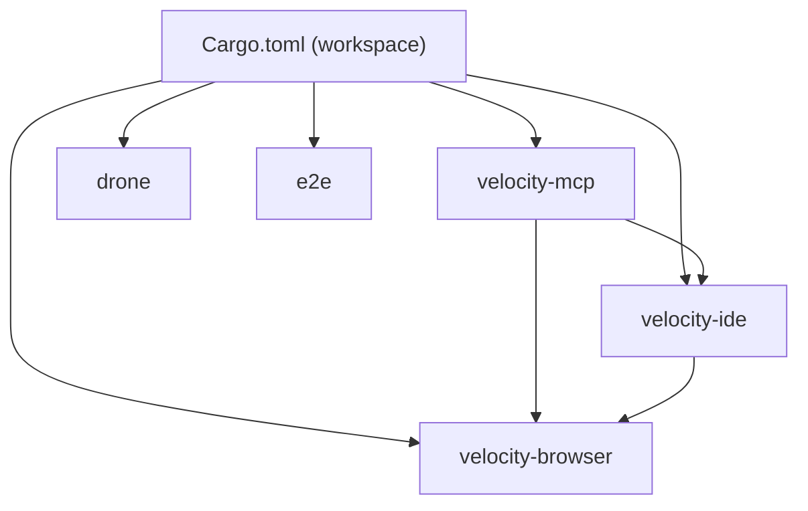
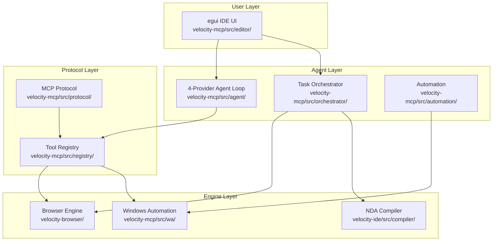

# Getting Started

<cite>
**Referenced Files in This Document**
- [README.md](file://README.md)
- [Cargo.toml](file://Cargo.toml)
- [AGENTS.md](file://AGENTS.md)
- [PRODUCT.md](file://PRODUCT.md)
- [velocity-mcp/Cargo.toml](file://velocity-mcp/Cargo.toml)
- [velocity-mcp/Justfile](file://velocity-mcp/Justfile)
- [velocity-browser/Cargo.toml](file://velocity-browser/Cargo.toml)
- [velocity-ide/Cargo.toml](file://velocity-ide/Cargo.toml)
</cite>

## Table of Contents
1. [Introduction](#introduction)
2. [Project Structure](#project-structure)
3. [Core Components](#core-components)
4. [Architecture Overview](#architecture-overview)
5. [Installation and Setup](#installation-and-setup)
6. [Running the IDE](#running-the-ide)
7. [Running Tests](#running-tests)
8. [Troubleshooting](#troubleshooting)

## Introduction

V.E.L.O.C.I.T.Y. is a high-performance, AI-native developer workspace built entirely in Rust. It combines a native GPU-accelerated IDE interface with a pure-Rust browser control plane, a self-correcting agentic compiler loop, a 4-provider AI reasoning engine, and a built-in LLM inference harness (Qwen 2.5 Coder 0.5B in NDA-4bit format). The project is organized as a Cargo workspace with 3 primary crates, a drone safety module, and end-to-end test harness — totaling over 525 source files.

This guide walks you through setting up your development environment, building the workspace, launching the IDE, and running validation checks.

## Project Structure

The repository is a Rust workspace (`resolver = "2"`) with five member crates:

```text
Kimi-Code/
├── velocity-mcp/          # MCP Server + Native IDE Editor (257 files)
│   ├── src/
│   │   ├── agent/         # 4-provider reasoning loop, dispatch, peer bridge
│   │   ├── editor/        # egui GUI: code editor, chat, browser panel, orchestrator
│   │   ├── registry/      # MCP tool definitions and dispatch
│   │   ├── automation/    # Task routing, build runner, watchers, instruction registry
│   │   ├── orchestrator/  # DAG scheduler, worktree isolation, worker runner
│   │   ├── compiler/      # JIT compiler, tokenizer, parser loader
│   │   ├── protocol/      # JSON-RPC and NMCP binary protocol
│   │   ├── connectors/    # HTTP, OAuth2, webhooks, sync, templates
│   │   ├── ipc/           # Shared memory telemetry
│   │   ├── security/      # Secrets management
│   │   ├── wa/            # Windows UI Automation (29 files)
│   │   └── benchmark/     # CPU/GPU benchmark runner
│   └── Cargo.toml
├── velocity-browser/      # Pure-Rust Browser Control Plane (171 files)
│   ├── src/
│   │   ├── dom/           # Slab DOM tree, shadow slots, mutations
│   │   ├── layout/        # Flexbox, grid, parallel layout solvers
│   │   ├── js/            # JS VM, Wasm interpreter, event loop
│   │   ├── net/           # HTTP/2-3, TLS 1.3, WebSocket, WebRTC
│   │   ├── engine/        # Browser engine capabilities (25 files)
│   │   ├── agentic/       # AOM tree, OCR, action predictor, reflection
│   │   ├── parser/        # HTML parser subsystem
│   │   ├── style/         # CSS style resolution
│   │   └── session*.rs    # Session management, auth, storage, history
│   └── Cargo.toml
├── velocity-ide/          # Compiler & NDA Pipeline (77 files)
│   ├── src/
│   │   ├── compiler/      # NDA lexer, parser, JIT, shaders, driver
│   │   ├── model/         # Transformer model config, NDA-4bit weights, zero-alloc inference
│   │   ├── nda_int/       # NDA interpreter (ops, tables, GEMV)
│   │   ├── site_map/      # RDF triple store, Merkle verification
│   │   ├── sandbox/       # JIT sandbox, scope validator
│   │   ├── wiki/          # Automated wiki generator
│   │   ├── pipeline_bridge.rs  # Dual-path engine (text ↔ NDA routing)
│   │   ├── pipeline_nda.rs     # NDA-native pipeline
│   │   └── tokenizer.rs        # BPE tokenizer (Qwen 2.5 Coder vocab)
│   └── Cargo.toml
├── drone/                 # Safety monitor (Rust binary)
├── e2e/                   # End-to-end integration tests
└── Cargo.toml             # Workspace manifest
```



**Diagram sources**
- [Cargo.toml](file://Cargo.toml)
- [velocity-mcp/Cargo.toml](file://velocity-mcp/Cargo.toml)
- [velocity-browser/Cargo.toml](file://velocity-browser/Cargo.toml)
- [velocity-ide/Cargo.toml](file://velocity-ide/Cargo.toml)

## Core Components

| Crate | Role | Key Entry Points |
|-------|------|------------------|
| `velocity-mcp` | MCP server, IDE editor, agent loop | `src/main.rs`, `src/editor/app/` |
| `velocity-browser` | Browser engine (no CDP) | `src/lib.rs`, `src/engine/` |
| `velocity-ide` | Compiler, NDA pipeline, site map | `src/lib.rs`, `src/compiler/` |
| `drone` | Safety monitor process | `src/main.rs` |
| `e2e` | Integration test harness | `tests/` |

Key responsibilities:
- **Agent Loop**: 4-provider AI reasoning with automatic failover (Cloudflare → OpenRouter → Azure → Ollama)
- **Native IDE**: egui-based GUI with code editor, chat panel, browser panel, orchestrator panel
- **Browser Engine**: Pure-Rust DOM, layout, JS VM, networking — no Chromium/CDP dependency
- **NDA Compiler**: Binary format pipeline with JIT, shaders, Merkle verification
- **Built-in LLM**: Qwen 2.5 Coder 0.5B in NDA-4bit format, zero-alloc forward pass, fused GEMV weights
- **Dual-Path Engine**: Text ↔ NDA routing for deterministic code generation
- **Windows Automation**: UIA FFI bridge for desktop automation

## Architecture Overview



## Installation and Setup

### Prerequisites
- **Rust toolchain**: Install via [rustup](https://rustup.rs/). Stable channel required.
- **Windows SDK**: Required for Windows UI Automation FFI (`wa/` module).
- **Vulkan SDK** (optional): Needed for GPU compute shader benchmarks in `velocity-ide/src/compiler/driver/`.

### Build Commands

```powershell
# Full workspace typecheck
cargo check --workspace

# Build all crates
cargo build

# Release build (optimized, stripped)
cargo build --release

# Run all tests
cargo test --workspace
```

### Using the Justfile

All validation commands are available via the Justfile in `velocity-mcp/`:

```powershell
cd velocity-mcp
just validate    # Full gate: check + test + clippy
just test        # Run test suite
just check       # Fast typecheck
just clippy      # Static analysis
just fmt         # Format code
```

## Running the IDE

Launch the native editor workspace:

```powershell
cargo run --manifest-path velocity-mcp/Cargo.toml -- --editor
```

Open a specific workspace directory:

```powershell
cargo run --manifest-path velocity-mcp/Cargo.toml -- --editor --workspace <path>
```

The `--workspace <path>` flag opens the specified directory in the editor. Without it, the IDE uses the current directory or falls back to the home directory.

### Configuration

Create a `.env` file at the workspace root:

```env
# Primary LLM Provider
LLM_PROVIDER=cloudflare

# OpenRouter
OPENROUTER_API_KEY=your-key
OPENROUTER_MODEL=tencent/hy3:free

# Azure OpenAI
AZURE_OPENAI_API_KEY=your-key
AZURE_OPENAI_ENDPOINT=https://your-resource.openai.azure.com/
AZURE_OPENAI_DEPLOYMENT=gpt-4o

# Local Ollama
OLLAMA_HOST=http://localhost:11434
OLLAMA_MODEL=llama3.2
```

## Running Tests

```powershell
# All workspace tests
cargo test --workspace

# Specific crate
cargo test -p velocity-mcp
cargo test -p velocity-browser
cargo test -p velocity-ide

# Integration tests
cargo test --manifest-path e2e/Cargo.toml
```

## Troubleshooting

- **Build failures on Windows**: Ensure Windows SDK is installed for UIA FFI. Check `velocity-mcp/src/wa/uia_ffi.rs` for required COM interfaces.
- **MSVC linker errors**: The workspace uses `debug = 1` in dev profile to prevent MSVC linker overflow. If you override this, expect link failures on large crates.
- **Missing LLM provider**: Set at least one provider in `.env`. The agent loop will failover automatically, but at least one must be configured.
- **Browser engine tests**: Some tests require network access for HTTP/2 and TLS handshakes.

**Section sources**
- [README.md](file://README.md)
- [AGENTS.md](file://AGENTS.md)
- [Cargo.toml](file://Cargo.toml)
- [velocity-mcp/Justfile](file://velocity-mcp/Justfile)
